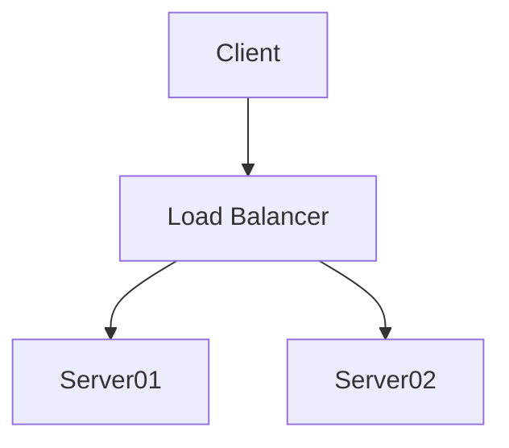
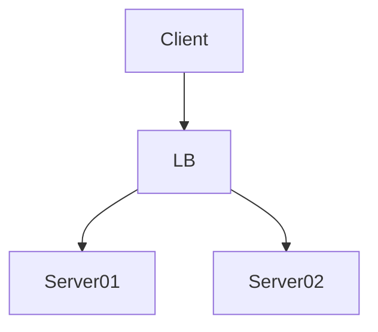

---
mermaid:
  themeVariables:
    lineColor: '#fff'
---

Foo


```mermaid
graph TD
A[Client] --> B[Load Balancer]
B --> C[Server01]
B --> D[Server02]
```

```js
const x = 1;
```

---

Bar


```mermaid
graph TD
A[Client] --> B[LB]
B --> C[Server01]
B --> D[Server02]
```

```js
const x = 2;
```
