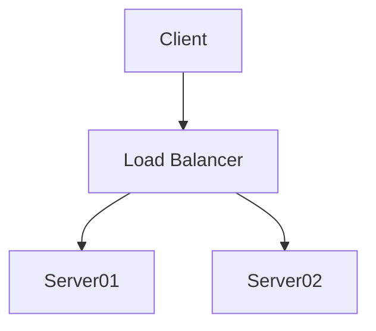
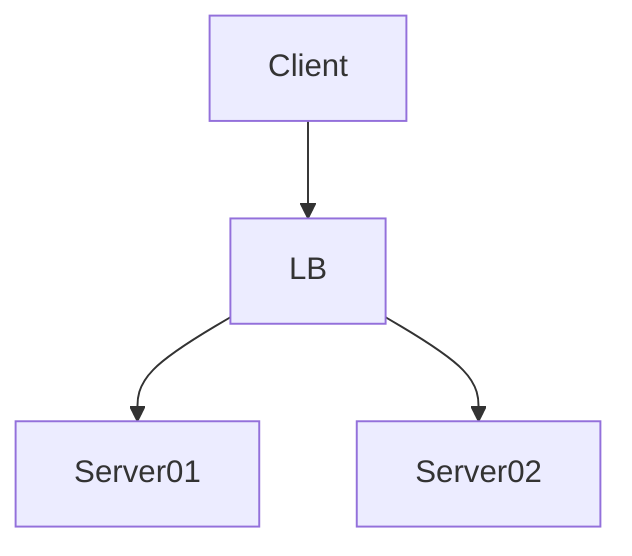

---
mermaid:
  themeVariables:
    lineColor: '#fff'
---

Slide A-1



```js
const x = 1;
```

---

Slide B-1



```js
const x = 2;
```

----

Slide B-2


```js
const x = 2;
```

---

Slide C-1


```js
const x = 2;
```
